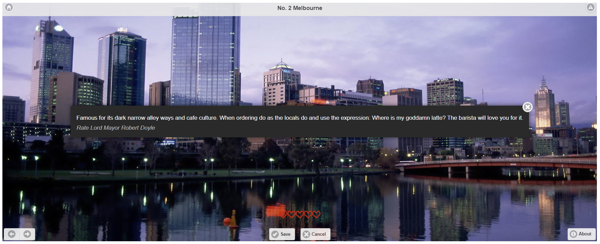

This is the **Cat/City of the Day (COTD)** User Interface. It is a PHP web application developed using JQuery Mobile that publishes a list of ordered items. Each item has an image and trivia associated with it. Item lists are organised as themes. The application looks for an environment variable known as `SELECTOR` to set the theme. The default theme is SELECTOR="pets" using images found on the internet. Other themes include "cats" and "cities". By default, item image content is sourced from the local data directory. If the environment variable `SERVICE` is set, the application will look for item data from the supplied URL address using the REST protocol. MySQL database meta data is also supported, look at include/selector.php for necessary settings.

# Configuration

Lists can be customized by editing the include/selector.php to point to set the theme of interest. Edit the data/$theme.php file populate the data for that $theme. Add images to the data/images/$theme subdirectory with names matching list items.

# Logging

Whenever the user rates an item, an entry is written to the php log. These entries can be filtered and then used to test hypotheses regarding user engagement.